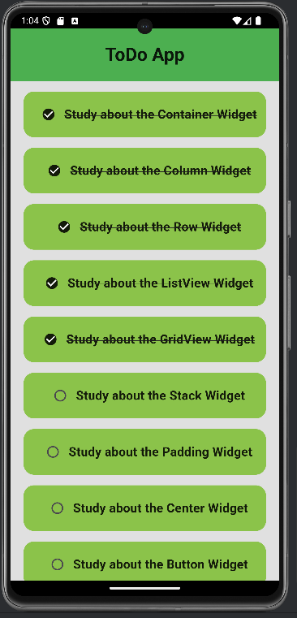
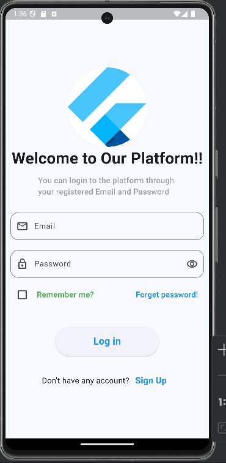
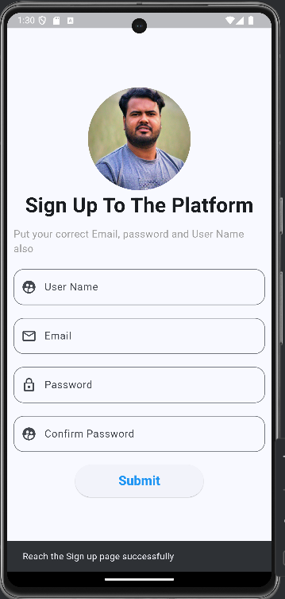
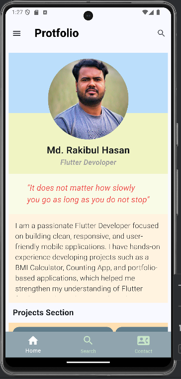
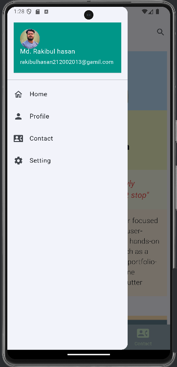
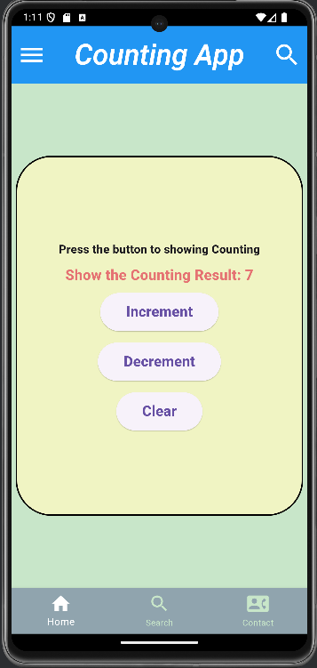
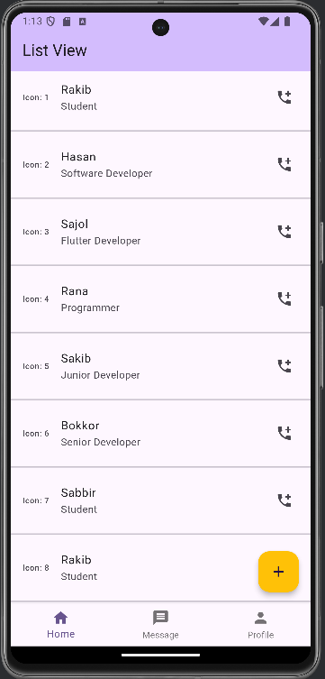
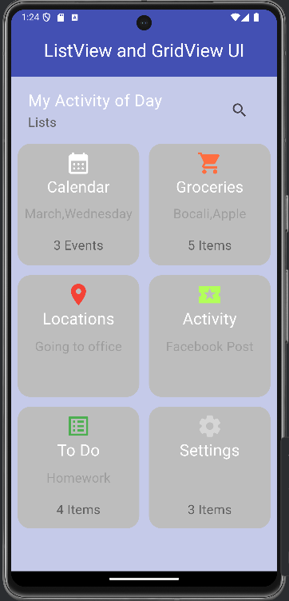

# 🎨 Flutter UI Showcase

<p align="center">
  
  
  
  
</p>

---

## 📌 Overview

**Flutter UI Showcase** is a collection of beautifully designed UI components and screens built using Flutter.

This project focuses on demonstrating different UI layouts, design patterns, and styling techniques that can be reused in real-world mobile applications.

It is ideal for beginners and intermediate developers who want to learn how to build clean and modern user interfaces in Flutter.

---

## 🎯 Project Goals

* Practice Flutter UI design
* Learn layout structuring and widget composition
* Build reusable UI components
* Improve design sense and responsiveness

---

## ✨ Key Features

* 📱 Multiple UI screens and layouts
* 🎨 Clean and modern design patterns
* 🧩 Reusable widgets/components
* 📐 Responsive layout handling
* ⚡ Smooth Flutter rendering

---

## 🧠 How It Works (Easy Explanation)

This project is mainly focused on **UI design**, not backend logic.

👉 Each screen or UI is built using Flutter widgets like:

* `Scaffold` → Main app layout
* `AppBar` → Top navigation bar
* `Column / Row` → Layout structure
* `Container` → Styling & spacing
* `ListView` → Scrollable UI

### 🔄 Flow:

1. `main.dart` → App starts from here
2. Calls main screen/widget
3. Different UI screens are loaded
4. Each screen shows a unique design

👉 Basically:

* No API
* No database
* Only UI rendering

---

## 🏗️ Architecture

* Widget-based architecture (Flutter standard)
* Screen-wise separation
* Reusable components for clean design

---

## 🛠️ Tech Stack

| Category  | Technology  |
| --------- | ----------- |
| Framework | Flutter     |
| Language  | Dart        |
| UI Design | Material UI |

---

## 📁 Project Structure

```bash id="z8kx2d"
lib/
│── main.dart
│── screens/
│   ├── home_screen.dart
│   ├── design_1.dart
│   ├── design_2.dart
│── widgets/
│   ├── custom_card.dart
│   ├── custom_button.dart
```

> ⚠️ Structure may vary 

---

## ⚙️ Getting Started

### 🔧 Prerequisites

* Install Flutter SDK → https://docs.flutter.dev/get-started/install

---

### 📥 Installation

```bash id="y4p2vm"
git clone https://github.com/rakibul-hasan212/flutter-ui-showcase.git
cd flutter-ui-showcase
flutter pub get
```

---

## ▶️ How to Run

```bash id="p9x3na"
flutter run
```

---

## 📸 Screenshots

### 📱 ToDo App 



---

### 👨‍💻 Profile UI Design with Navigator Page also works on Drawer

<p align="center">
  
  
  
  
</p>


---

### 📊 Counting App(Simple Increment and Decrement and Clear button Perform)

<p align="center">
  
</p>

---

### 💬 Contact Info (Apply the ListView)

<p align="center">
  
</p>

---

### 📱 Simple UI with ListView and GridView 



---

## 🚀 Use Cases

* 📱 UI design practice
* 🎓 Learning Flutter layouts
* 🧑‍💻 Portfolio showcase
* 🧩 Reusable component reference

---

## 🔌 UI Breakdown

* **Home Screen** → Entry point with navigation
* **UI Screens** → Different design layouts
* **Custom Widgets** → Reusable UI components

---

## ⚠️ Limitations

* No backend integration
* No API usage
* No state management (basic level)

---

## 🔮 Future Improvements

* Add state management (Provider / Riverpod)
* Connect with real APIs
* Improve animations
* Add dark mode support

---

## 🤝 Contributing

Contributions are welcome! 🎉

```bash id="6t7nqk"
# Fork the repository
# Create a branch
# Make changes
# Submit Pull Request
```

---

## 📜 License

This project is licensed under the **MIT License**.

---

## 👨‍💻 Author

Rakibul Hasan
<br>
🔗 GitHub: https://github.com/rakibul-hasan212

---

## 🌟 Support

If you like this project:

⭐ Star the repo
🍴 Fork it
📢 Share it

---

## 💡 Final Note

> “Design is not just what it looks like — it's how it works.” 🎨

Keep building beautiful UIs with Flutter 🚀


